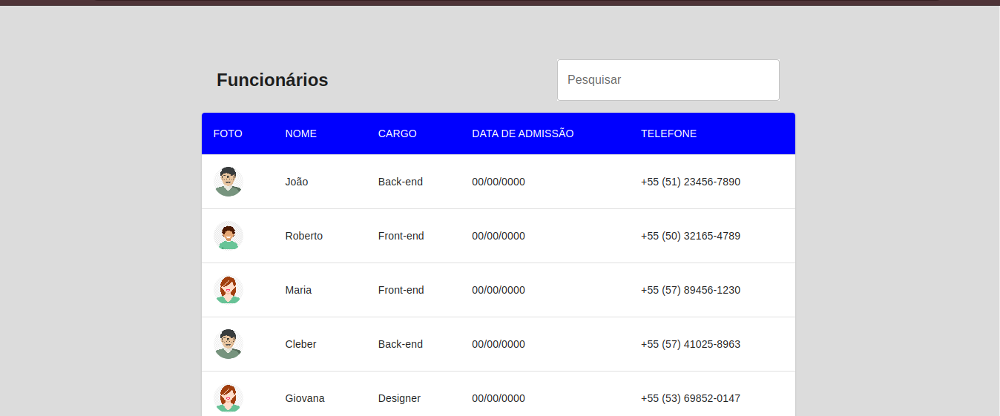

# Teste Prático Front-end

Este projeto consiste em construir a visualização de uma tabela de colaboradores com dados obtidos de uma API simulada utilizando `json-server`.

## 📋 Descrição do Projeto
O objetivo é exibir uma tabela responsiva contendo informações dos colaboradores, com a funcionalidade de pesquisa por nome, cargo e telefone. O layout segue o mockup fornecido no Figma.

## 🎯 Funcionalidades
- Exibição de uma tabela com os seguintes dados:
  - Foto (imagem de perfil do colaborador)
  - Nome
  - Cargo
  - Data de admissão
  - Telefone
- Pesquisa dinâmica por nome, cargo e telefone
- Formatação de datas e telefones no front-end
- Layout responsivo para desktop e mobile

## 🛠️ Tecnologias Utilizadas
- **React.js** (com TypeScript)
- **Material UI (MUI)** para estilização
- **Axios** para requisições HTTP
- **json-server** para simular uma API
- **Git** para controle de versão

## 🚀 Como Executar o Projeto
### 1️⃣ Clonar o repositório
```bash
git clone https://github.com/seu-usuario/be-talent-teste.git
cd be-talent-teste
```

### 2️⃣ Instalar as dependências
```bash
yarn install
```
Ou, se estiver usando npm:
```bash
npm install
```

### 3️⃣ Iniciar a API simulada
```bash
yarn json-server --watch db.json --port 3000
```
Ou:
```bash
npx json-server db.json --port 3000
```

### 4️⃣ Rodar a aplicação
```bash
yarn dev
```
Ou:
```bash
npm run dev
```

Acesse a aplicação no navegador: **[http://localhost:5173](http://localhost:5173)** (ou a porta usada pelo Vite).

# 📷 Screenshot




